# 6–7. Relationships & Indexing Strategy

## 6. Relationship diagram (Mermaid)

```mermaid
erDiagram
    TENANTS ||--o{ CUSTOMERS : has
    TENANTS ||--o{ EMPLOYEES : has
    TENANTS ||--o{ ROUTES : has

    CUSTOMERS ||--o{ CUSTOMERLOCATIONS : "has many"
    CUSTOMERS ||--o{ CUSTOMERCONTACTS : "has many"
    CUSTOMERS ||--o{ CUSTOMERSTATUSHISTORY : "status over time"
    CUSTOMERS ||--o{ CUSTOMERSERVICESCHEDULES : "schedule history"
    CUSTOMERS ||--o{ CUSTOMERPRICINGAGREEMENTS : "pricing over time"
    CUSTOMERS ||--o{ SERVICEVISITS : "has many"
    CUSTOMERS ||--o{ INVOICES : "has many"
    CUSTOMERS ||--o| CUSTOMERS : "parentCustomerId"

    CUSTOMERPRICINGAGREEMENTS ||--o{ CUSTOMERPRICINGITEMS : "has many rows"
    CUSTOMERPRICINGITEMS }o--|| SERVICEITEMS : "canonical item"
    CUSTOMERPRICINGITEMS }o--|| SERVICECATEGORIES : "category"
    CUSTOMERPRICINGITEMS }o--|| FREQUENCYDEFINITIONS : "normalized freq"

    SERVICEITEMS }o--|| SERVICECATEGORIES : "default category"
    ITEMCATEGORYMAPPINGS }o--|| SERVICECATEGORIES : "maps to"
    ITEMCATEGORYMAPPINGS }o--o| SERVICEITEMS : "maps to"

    INVOICES ||--o{ INVOICELINEITEMS : "has many"
    INVOICES }o--|| CUSTOMERS : "belongs to"
    INVOICES }o--o{ SERVICEVISITS : "links to 1..n visits"
    INVOICES }o--o| ROUTES : "invoice route (tier2)"
    INVOICES }o--o| EMPLOYEES : "assignedTo"

    INVOICELINEITEMS }o--|| INVOICES : "belongs to"
    INVOICELINEITEMS }o--o| SERVICEVISITS : "when identifiable"
    INVOICELINEITEMS }o--o| SERVICEITEMS : "canonical"
    INVOICELINEITEMS }o--|| SERVICECATEGORIES : "resolved category"
    INVOICELINEITEMS }o--o| ROUTES : "route"
    INVOICELINEITEMS }o--o| EMPLOYEES : "technician"

    SERVICEVISITS }o--|| CUSTOMERS : "belongs to"
    SERVICEVISITS }o--o| CUSTOMERLOCATIONS : "at location"
    SERVICEVISITS }o--o| ROUTES : "attributed route"
    SERVICEVISITS }o--o| EMPLOYEES : "technician"
    SERVICEVISITS }o--o| INVOICES : "may link"
    SERVICEVISITS ||--o| ROUTELEGS : "outgoing leg to next visit"

    ROUTELEGS }o--|| SERVICEVISITS : "fromVisit"
    ROUTELEGS }o--|| SERVICEVISITS : "toVisit"
    ROUTELEGS }o--o| MAPBOXROUTECACHE : "cache hit"

    EMPLOYEES ||--o{ EMPLOYEESOURCEMAPPINGS : "id mappings"
    EMPLOYEES ||--o{ EMPLOYEERATEHISTORY : "rate over time"
    EMPLOYEES ||--o{ PAYROLLENTRIES : "has many"
    EMPLOYEES ||--o{ EMPLOYEEAVAILABILITY : "per period"
    EMPLOYEES ||--o{ ROUTEASSIGNMENTHISTORY : "route over time"
    EMPLOYEES ||--o{ SERVICEVISITS : "performs"

    PAYROLLPERIODS ||--o{ PAYROLLENTRIES : "has many"
    PAYROLLPERIODS ||--o{ EMPLOYEEAVAILABILITY : "has many"

    ROUTES ||--o{ ROUTEASSIGNMENTHISTORY : "assignments"
    ROUTES ||--o{ SERVICEVISITS : "runs"

    DAILYTECHNICIANMETRICS }o--|| EMPLOYEES : "rolls up"
    MONTHLYROUTEMETRICS }o--|| ROUTES : "rolls up"
    MONTHLYCUSTOMERMETRICS }o--|| CUSTOMERS : "rolls up"
    MONTHLYCATEGORYMETRICS }o--|| SERVICECATEGORIES : "rolls up"

    IMPORTBATCHES ||--o{ DATAQUALITYISSUES : "detects"
```

### Reference vs. embed decisions

- **Reference (separate collections):** invoice ↔ line items (unbounded), customer ↔ visits/invoices,
  visits ↔ route legs, employee ↔ payroll. Rationale: high cardinality, independent write/query paths,
  and BI aggregation across parents.
- **Embed:** `source` metadata, `addressLines[]`, `availableRates[]`, category-revenue sub-arrays inside
  monthly summaries (bounded), GeoJSON geometry on route legs. Rationale: bounded, always read with parent.
- **Denormalize (controlled):** `invoiceDate`, `monthKey`, `serviceCategoryId`, `routeStarAccountNumber`,
  `invoiceStatus`, `isRevenueRecognized` onto `invoiceLineItems` to keep line-level BI filters index-only
  and avoid `$lookup` on the hot path. Denormalized fields are recomputed by ETL when the parent changes.

---

## 7. Indexing strategy

All indexes lead with `tenantId` (every query is tenant-scoped). Types & rationale below; index
build definitions live in the Mongoose models (`../src/models/`). Prefer few, high-selectivity compound
indexes over many single-field ones.

### 7.1 Required indexes by collection

**customers**
- `{tenantId:1, routeStarCustomerId:1}` **unique** — primary join key.
- `{tenantId:1, routeStarAccountNumber:1}` **unique, partial** (`routeStarAccountNumber` exists) — business key.
- `{tenantId:1, customerName:1}` — name search only (NOT a join key).
- `{tenantId:1, quickBooksCustomerId:1}` **sparse** — recon join.
- `{tenantId:1, customerStatus:1}` — status filters.

**customerLocations**
- `{tenantId:1, customerId:1}`
- `{location:'2dsphere'}` — geo radius / density.
- `{tenantId:1, addressHash:1}` — dedupe & change detection.
- `{tenantId:1, customerId:1, isActive:1, effectiveStart:-1}` — current location lookup.

**customerPricingItems**
- `{tenantId:1, customerId:1, isActive:1, effectiveStart:-1}` — current price for a customer.
- `{tenantId:1, serviceItemId:1, effectiveStart:-1}`
- unique `{tenantId:1, 'source.sourceSystem':1, 'source.sourceRecordId':1, effectiveStart:1}` — idempotent history upsert.

**serviceItems**: `{tenantId:1, itemCode:1}` **unique**; `{tenantId:1, sourceItemIds:1}`.
**serviceCategories**: `{tenantId:1, categoryCode:1}` **unique**.
**itemCategoryMappings**: `{tenantId:1, matchType:1, matchValue:1}` **unique**; `{tenantId:1, reviewStatus:1}`.
**frequencyDefinitions**: `{tenantId:1, normalizedFrequency:1}` **unique**.

**employees**: `{tenantId:1, employeeCode:1}` **unique**; `{tenantId:1, adpEmployeeId:1}` sparse;
`{tenantId:1, routeStarTechId:1}` sparse; `{tenantId:1, isTechnician:1, status:1}`.
**employeeSourceMappings**: `{tenantId:1, sourceSystem:1, sourceEmployeeId:1}` **unique, partial**;
`{tenantId:1, sourceSystem:1, nameNormalization:1}`.
**employeeRateHistory**: `{tenantId:1, employeeId:1, effectiveStart:-1}`.

**payrollPeriods**: `{tenantId:1, periodStart:1, periodEnd:1}`; `{tenantId:1, payFrequency:1}`.
**payrollEntries**:
- `{tenantId:1, employeeId:1, payrollPeriodId:1}` **unique**.
- `{tenantId:1, 'source.sourceRecordId':1}` **unique**.
- `{tenantId:1, payrollPeriodId:1}`.
**employeeAvailability**: `{tenantId:1, employeeId:1, payrollPeriodId:1}` **unique**.

**routes**: `{tenantId:1, routeCode:1}` **unique**.
**routeAssignmentHistory**: `{tenantId:1, routeId:1, effectiveStart:-1}`; `{tenantId:1, technicianId:1, effectiveStart:-1}`.

**serviceVisits** (hot collection — most operational queries):
- `{tenantId:1, technicianId:1, serviceDate:1, arrivalAt:1}` — check-in/out report, route-leg ordering.
- `{tenantId:1, routeId:1, serviceDate:1}` — route reports.
- `{tenantId:1, customerId:1, serviceDate:1}` — client history.
- `{tenantId:1, invoiceId:1}` — invoice↔visit linkage.
- `{tenantId:1, completionStatus:1, serviceDate:1}` — status volume.
- `{tenantId:1, monthKey:1, technicianId:1}` — monthly rollups.
- `{tenantId:1, elapsedTimeValidationStatus:1}` — DQ.

**invoices**:
- `{tenantId:1, invoiceNumber:1}` **unique**.
- `{tenantId:1, customerId:1, invoiceDate:1}`
- `{tenantId:1, routeId:1, invoiceDate:1}`
- `{tenantId:1, status:1, invoiceDate:1}`
- `{tenantId:1, monthKey:1}`; `{tenantId:1, reconciliationStatus:1}` (DQ).

**invoiceLineItems**:
- `{tenantId:1, invoiceId:1}`
- `{tenantId:1, serviceCategoryId:1, invoiceDate:1}` — revenue by category.
- `{tenantId:1, customerId:1, invoiceDate:1}`
- `{tenantId:1, routeId:1, invoiceDate:1}`
- `{tenantId:1, monthKey:1, serviceCategoryId:1}` — monthly category rollup.
- `{tenantId:1, serviceVisitId:1}` — revenue-per-stop join.
- `{tenantId:1, validationStatus:1}` (DQ).

**routeLegs**:
- `{tenantId:1, technicianId:1, serviceDate:1}`
- `{tenantId:1, fromVisitId:1, toVisitId:1}` **unique**.
- `{tenantId:1, routeId:1, serviceDate:1}`
- `{tenantId:1, calculationStatus:1}` (DQ + recompute targeting).

**mapboxRouteCache**: `{originHash:1, destinationHash:1, profile:1, timeBucket:1}` **unique**;
optional TTL `{expiresAt:1}` (expireAfterSeconds:0) for traffic-aware entries only.

**Governance**:
- `importBatches`: `{tenantId:1, sourceSystem:1, startedAt:-1}`, `{status:1}`.
- `sourceSyncStates`: `{tenantId:1, sourceSystem:1, sourceEntity:1}` **unique**.
- `dataQualityIssues`: `{tenantId:1, resolutionStatus:1, severity:1, detectedAt:-1}`,
  `{tenantId:1, issueType:1}`, `{tenantId:1, collectionName:1, recordId:1}`.
- `auditLog`: `{tenantId:1, entity:1, entityId:1, at:-1}`.

**Materialized summaries** (unique on grain → idempotent upsert):
- `dailyTechnicianMetrics`: `{tenantId:1, technicianId:1, serviceDate:1}` **unique**; `{tenantId:1, monthKey:1}`.
- `monthlyRouteMetrics`: `{tenantId:1, routeId:1, monthKey:1}` **unique**.
- `monthlyCustomerMetrics`: `{tenantId:1, customerId:1, monthKey:1}` **unique**.
- `monthlyCategoryMetrics`: `{tenantId:1, serviceCategoryId:1, monthKey:1, routeId:1, technicianId:1}` **unique**
  (use sentinel `null`/`ALL` for absent dimensions so the unique key is stable).

**Raw layer**: `{tenantId:1, sourceSystem:1, sourceEntity:1, sourceRecordId:1, recordHash:1}` **unique**;
`{tenantId:1, importBatchId:1}`.

### 7.2 Index trade-offs & guidance

- **Write cost:** `serviceVisits`, `invoiceLineItems`, `routeLegs` are the write-heavy, high-cardinality
  collections. Keep them to the ~6–8 compound indexes listed; each extra index taxes every bulk upsert.
  The denormalized fields (`monthKey`, `serviceCategoryId`, `invoiceDate`, `isRevenueRecognized`) let a
  handful of compound indexes cover the common BI queries, avoiding a broader index set.
- **Partial/sparse:** `routeStarAccountNumber` and `quickBooksCustomerId` uniqueness use partial indexes
  (`partialFilterExpression`) so legacy rows without the value don't collide on `null`.
- **Unique history upserts:** history collections add `effectiveStart` to the unique key so a superseding
  version doesn't violate uniqueness while the prior version stays intact.
- **2dsphere:** only on `customerLocations.location`; route-leg geometry is stored but not indexed
  (never queried spatially — only rendered).
- **Avoid:** single-field indexes on low-cardinality enums alone (e.g. `completionStatus` by itself) —
  always pair with `serviceDate`/`monthKey`. Don't index free-text notes.
- **ESR rule:** compound indexes are ordered Equality → Sort → Range (e.g. `technicianId` eq,
  `serviceDate` range/sort). This is why `arrivalAt` trails `serviceDate` in the visits index.
- **Collation:** for case-insensitive name search on `customerName`, attach a collation
  (`{locale:'en', strength:2}`) to that index rather than storing a lowercased duplicate field.

Next: [`04-etl-mapbox.md`](04-etl-mapbox.md).
